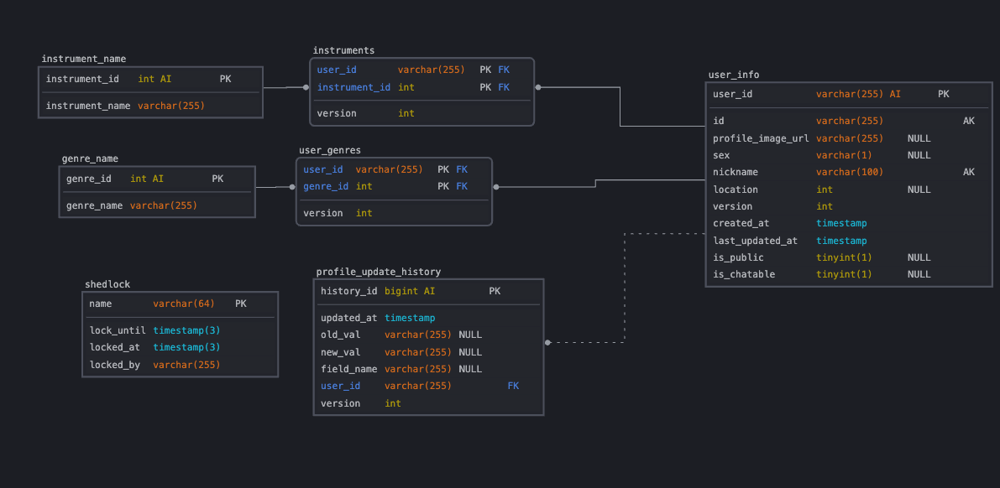
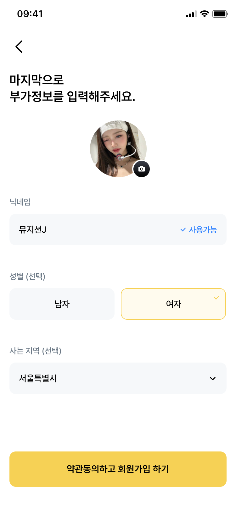

## 와방 쩌는 스프링부트 프로필 서버 만들기

---

### 기존 인프라 상황 :
- Auth-server: 에서 이메일 인증이 된 유저면, 이벤트를통해 새로운 유저가 만들어졌다고, 통보를 받는다. 
- 회원 정보 삭제(탈퇴후 3년뒤) 유저가 삭제 되면, 이벤트를 통해 유저의 정보를 삭제하라고 통보를 받는다. 

### 인프라 구축 예정 상황 :
- 프로필 수정 요청이 들어오면, 이미지 서버에 최신의 프로필 이미지를 받아 와야한다.

---
### 요구사항 정리 
- [ ] 닉네임, 장르, 악기로 필터링이 가능해야함
- [ ] 유저는 언제든 프로필을 수정 할 수 있어야함 
- [ ] 이메일 인증을 한 유저는 하나의 프로필을 갖고 있어야함.
- [ ] 한 유저는 여러 장르, 악기를 선택 할 수 있어야 함 
- [ ] 닉네임이 같은 여러명의 유저는 존재 하지 않음 
- [ ] 한 유저는 하나의 프로필 이미지를 갖고 있어야 함
- [ ] 프로필 서버는 3대의 스케일 아웃을 고려중이며, 1대의 높은 하드웨어 서버와 2대의 예비서버로 구성됨 
- [ ] 유저는 오직 개인의 프로필만 수정 할 수있음

---

### ERD

- 장르와 , 선호악기는 프로필과 M:N 매핑 관계
- 조회 및 필터 기능에서 성능 최적화가 수준 높게 요구됨
- [ ] 장르, 악기 종류가 추가 되어도 서버는 지속적으로 운영되어야 함.
- [ ] 서버가 처음 켜질때 데이터 베이스의 이름 목록을 조회 해야됨.
---

### 요구사항 명세 프로필 
- 유저는 프로필 이미지, 닛네임, 성별, 지역, 선호 장르, 선호 악기, 자기소개 항목을 갖는다. 
- 유저는 프로필을 비공개, 공개를 선택할 수 있다. 
- 유저는 채팅 수발신을 선택 할 수 있다.
- 이메일 인증이 되지 않은 유저는 프로필을 가질 수 없다. 

---
- 장르 목록
  ROCK,
  POP,
  JAZZ,
  CLASSICAL,
  HIP_HOP,
  ELECTRONIC,
  FOLK,
  BLUES,
  REGGAE,
  METAL,
  COUNTRY,
  LATIN,
  RNB,
  SOUL,
  FUNK,
  PUNK,
  ALTERNATIVE,
  INDIE,
  GOSPEL,
  OPERA,
  SOUNDTRACK,
  WORLD_MUSIC,
  OTHER // 기타

- 지역 목록  
  서울,
  부산,
  대구,
  인천,
  광주,
  대전,
  울산,
  경기,
  강원,
  충북,
  충남,
  전북,
  전남,
  경북,
  경남,
  제주,
  ETC

- 악기 목록 
    VOCAL,
  GUITAR,
  BASS,
  DRUM,
  KEYBOARD,
  PERCUSSION,
  SAXOPHONE,
  VIOLIN,
  CELLO,
  TRUMPET,
  FLUTE,
  DJ,
  PRODUCER,
  ETC // 기타

---
### 예시 프로필 등록 사진

