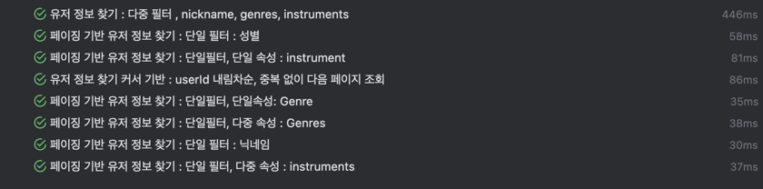
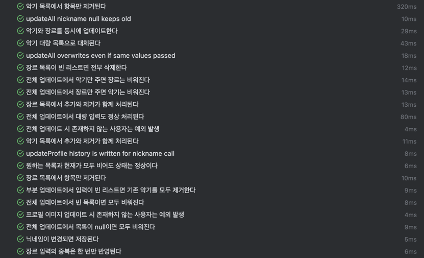
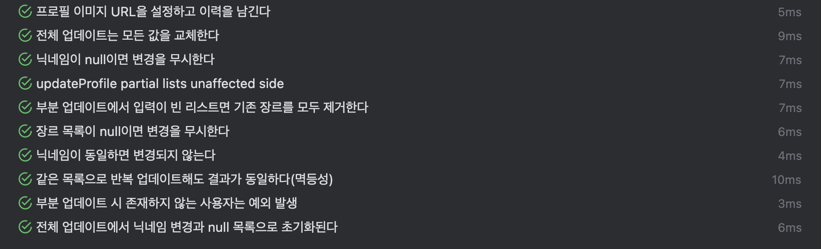
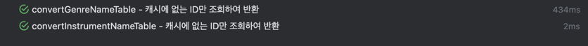
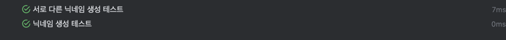
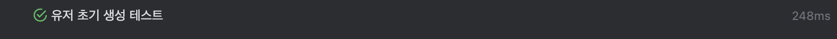

## 와방 쩌는 스프링부트 프로필 서버 만들기

---

### 기존 인프라 상황 :
- Auth-server: 에서 이메일 인증이 된 유저면, 이벤트를통해 새로운 유저가 만들어졌다고, 통보를 받는다. 
- 회원 정보 삭제(탈퇴후 3년뒤) 유저가 삭제 되면, 이벤트를 통해 유저의 정보를 삭제하라고 통보를 받는다. 

### 인프라 구축 예정 상황 :
- 프로필 수정 요청이 들어오면, 이미지 서버에 최신의 프로필 이미지를 받아 와야한다.

---
### 요구사항 정리 
- [x] 닉네임, 장르, 악기로 필터링이 가능해야함
- [x] 유저는 언제든 프로필을 수정 할 수 있어야함 
- [ ] 이메일 인증을 한 유저는 하나의 프로필을 갖고 있어야함.
- [x] 한 유저는 여러 장르, 악기를 선택 할 수 있어야 함 
- [x] 닉네임이 같은 여러명의 유저는 존재 하지 않음 
- [x] 한 유저는 하나의 프로필 이미지를 갖고 있어야 함
- [x] 프로필 서버는 3대의 스케일 아웃을 고려중이며, 1대의 높은 하드웨어 서버와 2대의 예비서버로 구성됨 
- [ ] 유저는 오직 개인의 프로필만 수정 할 수있음
- [ ] 유저의 프로필 뷰 요청과 프로필 수정 뷰가 다름 (IssuesNo10-2)
- [ ] 프로필 카드뷰를 따로 DTO로 전달 가능 해야함 (IssuesNo10-2)
- [x ] 악기와 장르는 최대 3가지씩만 고를 수 있음 (IssuesNo10-1)

---

### ERD

- 장르와 , 선호악기는 프로필과 M:N 매핑 관계
- 조회 및 필터 기능에서 성능 최적화가 수준 높게 요구됨
- [x] 장르, 악기 종류가 추가 되어도 서버는 지속적으로 운영되어야 함.
- [x] 서버가 처음 켜질때 데이터 베이스의 이름 목록을 조회 해야됨.
---

### 요구사항 명세 프로필

-[x] 유저는 프로필 이미지, 닛네임, 성별, 지역, 선호 장르, 선호 악기, 자기소개 항목을 갖는다. 
-[x] 유저는 프로필을 비공개, 공개를 선택할 수 있다. 
-[x] 유저는 채팅 수발신을 선택 할 수 있다.
-[x] 이메일 인증이 되지 않은 유저는 프로필을 가질 수 없다. 
-[x] 유저 프로필 업데이트시에 변화만 주는게 아니라 모든 데이터를 다시 준다.
-[x] dsl 을 이용해 모든 협의된 카테고리에 대한 프로필 조회가 가능해야한다.
  - [x] N+1 문제 해결
 
--- 

### 페이징 처리기법 성능 비교 테스트

---
- 장르 목록
  ROCK,
  POP,
  JAZZ,
  CLASSICAL,
  HIP_HOP,
  ELECTRONIC,
  FOLK,
  BLUES,
  REGGAE,
  METAL,
  COUNTRY,
  LATIN,
  RNB,
  SOUL,
  FUNK,
  PUNK,
  ALTERNATIVE,
  INDIE,
  GOSPEL,
  OPERA,
  SOUNDTRACK,
  WORLD_MUSIC,
  OTHER // 기타

- 악기 목록 
    VOCAL,
  GUITAR,
  BASS,
  DRUM,
  KEYBOARD,
  PERCUSSION,
  SAXOPHONE,
  VIOLIN,
  CELLO,
  TRUMPET,
  FLUTE,
  DJ,
  PRODUCER,
  ETC // 기타

- 지역 목록  
  서울,
  부산,
  대구,
  인천,
  광주,
  대전,
  울산,
  경기,
  강원,
  충북,
  충남,
  전북,
  전남,
  경북,
  경남,
  제주,
  ETC
---
# TEST 
- 2025-09-14

---
### 예시 프로필 등록 사진

---
## 배포 가이드: docker-compose + .env 만으로 실행 (Ubuntu 22.04)

이 서버는 사전 빌드된 Docker Hub 이미지를 사용하므로, 운영 서버에는 소스코드가 없어도 됩니다. 아래 2개 파일만 서버에 복사하세요.
- docker-compose.yml
- .env.prod (환경변수 파일)

사전 준비
- 서버에 Docker와 Docker Compose(Plugin)가 설치되어 있어야 합니다.
- Docker Hub에 로그인되어 있어야 사설 이미지 접근 시 문제가 없습니다.

필수 명령어 예시
1) Docker Hub 로그인
- docker login

2) (선택) 외부 네트워크 준비: infra-network
- 이 Compose는 데이터베이스 등 인프라 컨테이너와 연결하기 위해 외부 네트워크(infra-network)를 사용합니다.
- 서버에 해당 네트워크가 없다면 아래 명령으로 먼저 생성하세요.
- docker network create infra-network

3) 파일 배치
- 서버의 원하는 디렉터리(예: ~/apps/profile-server)로 이동 후, 로컬에서 준비한 파일 2개를 업로드합니다.
  - docker-compose.yml
  - .env.prod

4) 컨테이너 실행
- docker compose pull
- docker compose up -d

5) 상태 확인
- docker compose ps
- docker logs -f profile-server-1

접속 방법
- Nginx가 9100 포트로 노출되며, 내부에서 profile-server-1~3으로 라운드 로빈 프록시합니다.
- http://<서버IP>:9100 으로 접속합니다.

구성 설명
- 애플리케이션 컨테이너: ddingsh9/profile-server:1.7 이미지를 사용합니다. 최신 이미지를 받도록 pull_policy: always가 설정되어 있습니다.
- Nginx 컨테이너: 컨테이너 시작 시 내부에서 프록시 설정 파일을 생성하므로, 별도의 nginx 폴더나 로컬 마운트가 필요 없습니다.
- 스케일 아웃: profile-server-1, 2, 3 세 대로 구성되어 있고 Nginx가 라운드로빈으로 트래픽을 분산합니다.
- 네트워크: profile-network(내부 브리지)와 외부 인프라 네트워크(infra-network)를 사용합니다. 외부 네트워크가 없으면 직접 생성해야 합니다.

환경변수(.env.prod) 안내
- 기존에 사용하던 .env.prod 형식을 그대로 사용하세요. Compose는 각 profile-server 인스턴스에 동일하게 주입합니다.

문제 해결 팁
- docker compose up 시 infra-network 가 없다는 오류가 나면, 먼저 docker network create infra-network 를 실행하세요.
- 이미지 풀 실패 시 docker login 으로 인증 후 다시 시도하세요.
- 포트 충돌 시 docker-compose.yml의 nginx -> ports 설정(왼쪽 호스트 포트 9100)을 변경하세요.

---
## 로컬에서 Docker 이미지 빌드/푸시하는 방법 (개발 PC)
- 목적: 서버에서는 이미지를 빌드하지 않고, 미리 빌드/푸시된 이미지를 pull 해서만 실행합니다. 서버에서 `build`를 시도하면 `COPY gradlew` 같은 에러가 납니다(빌드 컨텍스트에 파일이 없기 때문).

사전 준비
- Docker Hub 계정: ddingsh9
- 로컬 프로젝트 루트에서 실행하세요(여기에 Dockerfile, gradlew 등이 존재함).

1) 로그인
- docker login

2) 멀티플랫폼(선택) 설정: buildx 사용 예시
- docker buildx create --use --name profile-builder || true
- docker buildx use profile-builder

3) 이미지 빌드 및 태깅 예시
- 버전을 정합니다: 예) 1.7 또는 1.8 등
- docker buildx build -t ddingsh9/profile-server:1.7 --platform linux/amd64 .
  - 멀티플랫폼 푸시까지 한 번에 하고 싶다면: 
  - docker buildx build -t ddingsh9/profile-server:1.7 --platform linux/amd64,linux/arm64 --push .

4) 푸시(멀티플랫폼으로 바로 push 안했다면)
- docker push ddingsh9/profile-server:1.7

5) docker-compose.yml 이미지 태그 업데이트(필요 시)
- image: ddingsh9/profile-server:<원하는_버전>

6) 서버에서는 빌드 금지, pull + up만 실행
- docker compose pull
- docker compose up -d

왜 서버에서 `COPY gradlew` 에러가 나나요?
- 서버에는 소스가 없고 docker-compose.yml만 있으므로, 빌드 컨텍스트에 gradlew/Dockerfile 등이 존재하지 않습니다.
- 따라서 Compose가 `build:`를 수행하면 Docker는 필요한 파일을 찾지 못해 실패합니다.
- 본 저장소의 docker-compose.yml은 `build:`를 제거하고 `image:`만 사용하도록 설정되어 있으므로, 서버에서는 오직 pull/up만 하면 됩니다.
